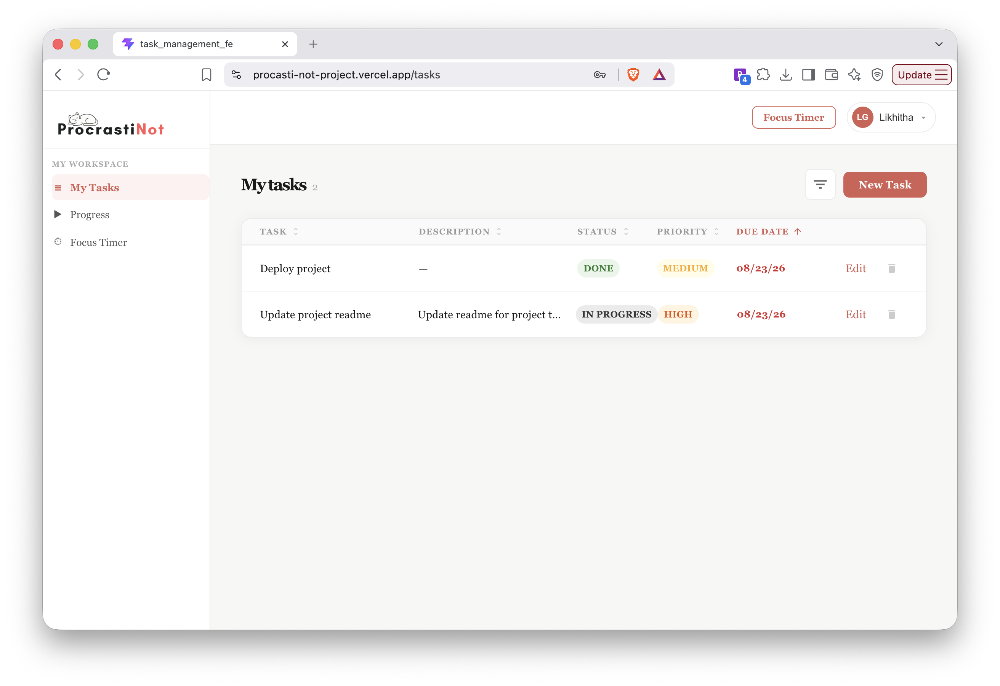

# ProcastiNot

A task management app that helps you beat procrastination by breaking work into 
manageable tasks and staying focused with built-in time management tools.

## Features

- User authentication with JWT (register, login, secure sessions)
- Create, edit, and delete tasks
- Set deadlines and reminders
- Categorize and prioritize tasks
- Focus/time management tools to stay on track

## Tech Stack

**Frontend:** React, TypeScript, Vite, Redux Toolkit
**Backend:** Java, Spring Boot, Spring Security, JWT
**Database:** MySQL
**Deployment:** Vercel (frontend), Railway (backend + database)

## Screenshots

